<a href="https://swanbase.co/en/">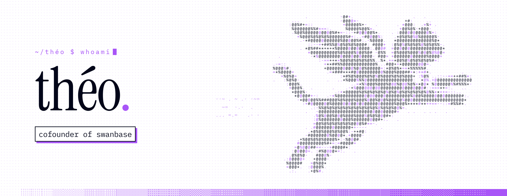</a>

I run [swanbase](https://swanbase.co/en/) with [Vincent](https://github.com/the20100), a growth marketing accelerator in Paris for early-stage European startups. We take founders from their first 10 customers to their first 1,000: ads, cold email, SEO, conversion. It costs them €0, and we stay with them until the exit. Before that, we ran growth for 96 startups at Panja, from 2017 to 2024.

Everything we learn there ends up as a tool, open source when we can. On the side, I study how LLMs reason and make decisions, mostly the cases where they break.

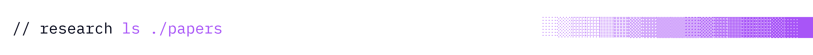

<a href="https://github.com/tns-research/constraint-coherence">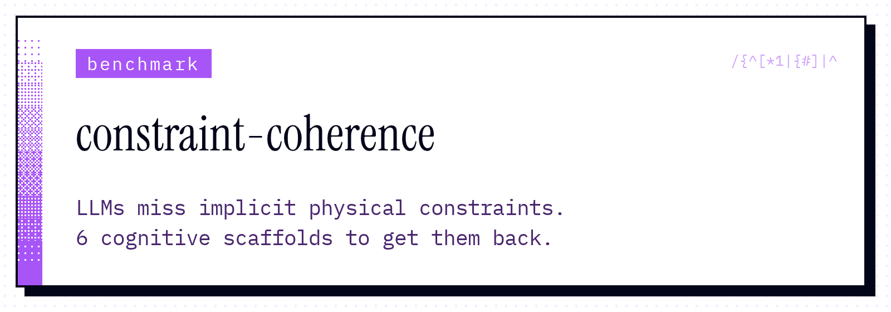</a><a href="https://github.com/tns-research/llm-finance-framework">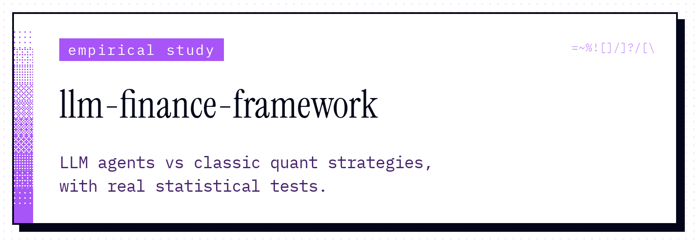</a> 
<a href="https://github.com/tns-research/counterpoint">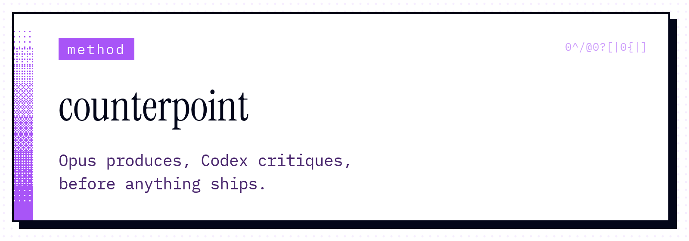</a><a href="https://github.com/tns-research/agent-evals">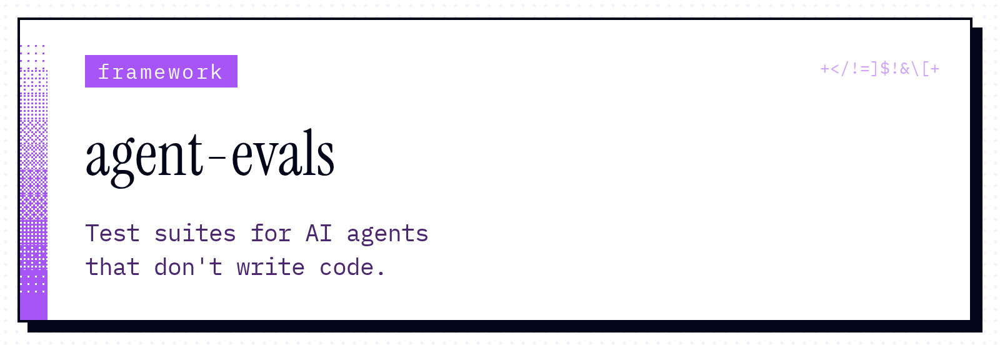</a>

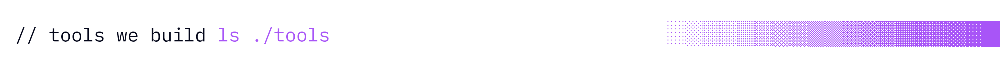

<a href="https://fog-agents.com">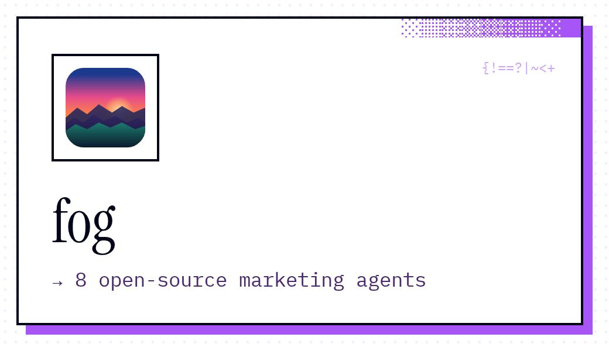</a><a href="https://st4lk.com">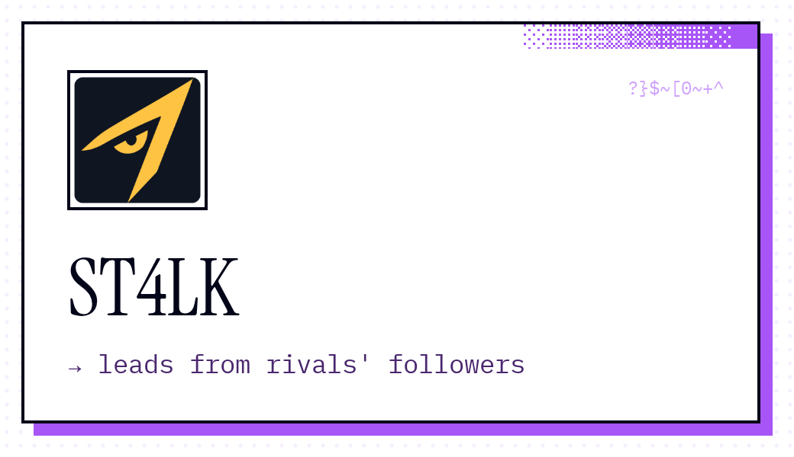</a><a href="https://nametlas.com">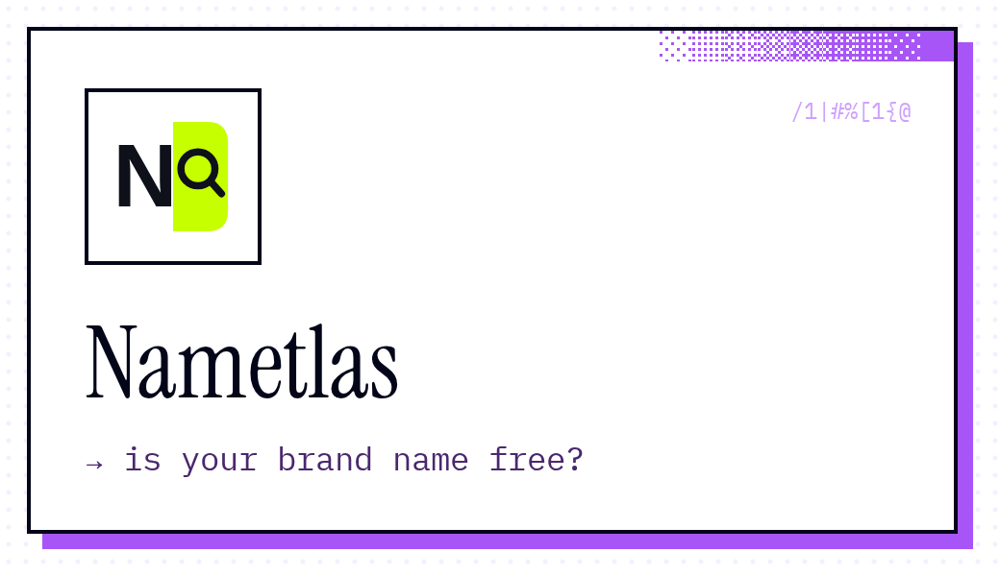</a> 
<a href="https://press3dparis.com">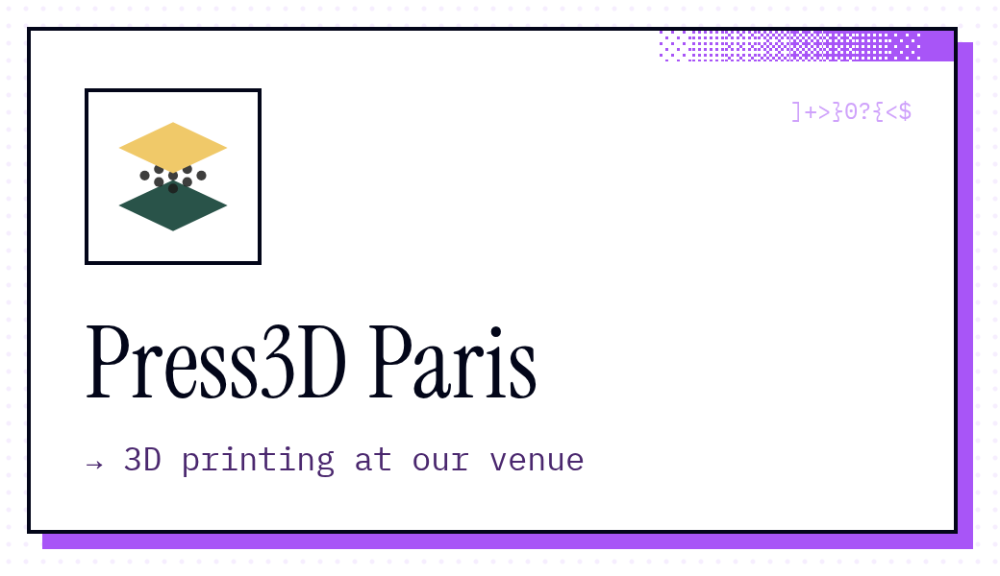</a><a href="https://app.panja.io">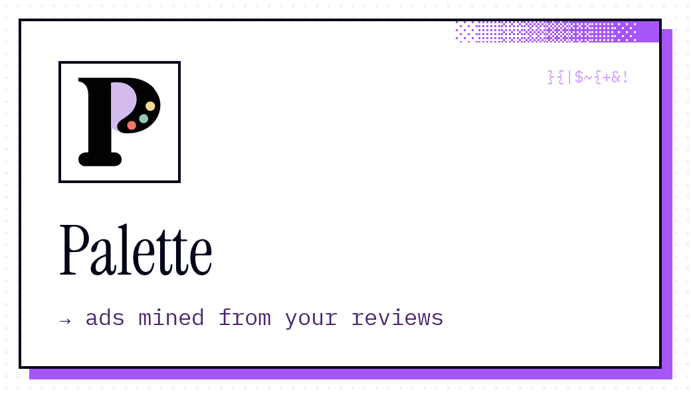</a><a href="https://github.com/tns-research/swanclip">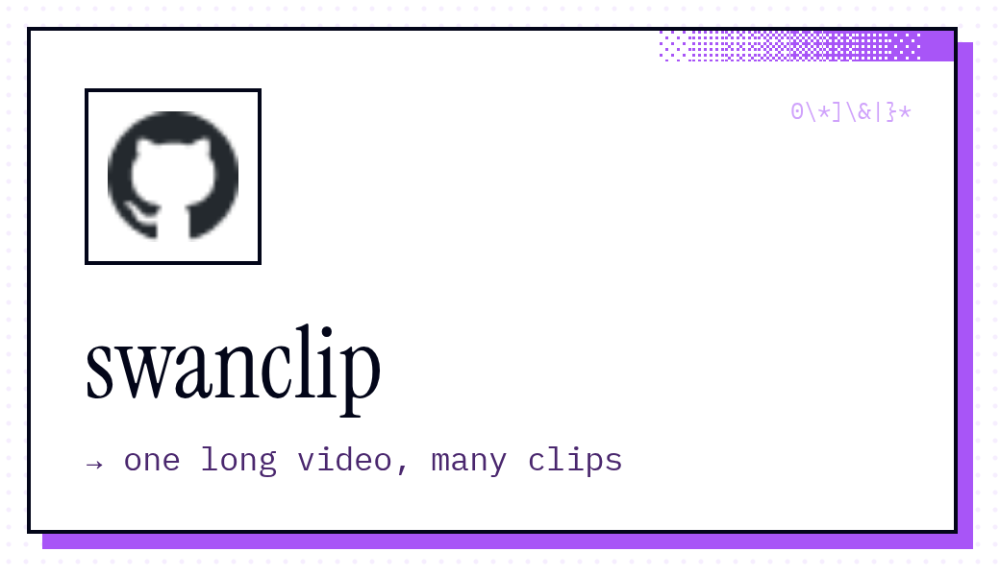</a>

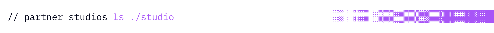

<a href="https://panja.io">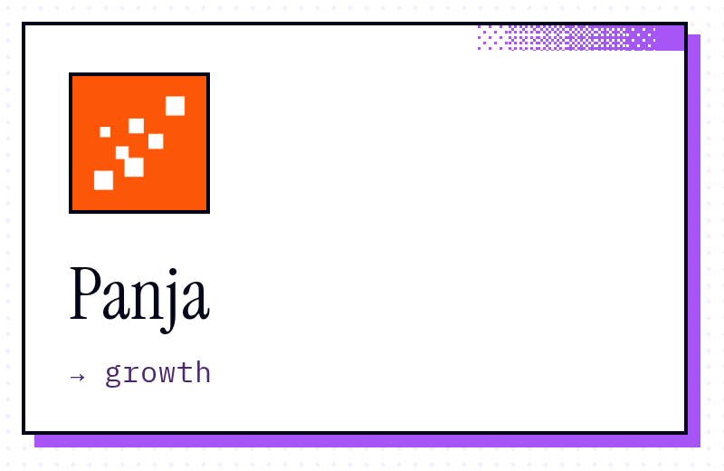</a><a href="https://swanbase.co/en/studio/takema-studio-ugc-video-agency/">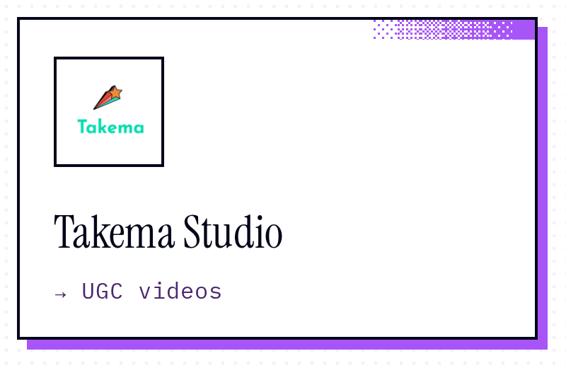</a><a href="https://swanbase.co/en/studio/monweb-dev-website-maintenance-subscription/">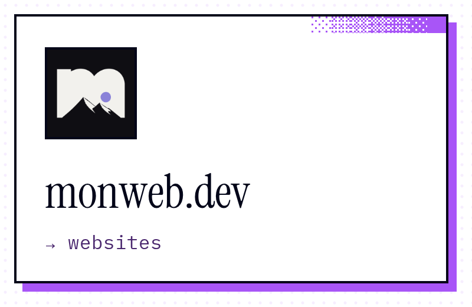</a><a href="https://swanbase.co/en/studio/growth-prospect-cold-email-ai-prospecting/">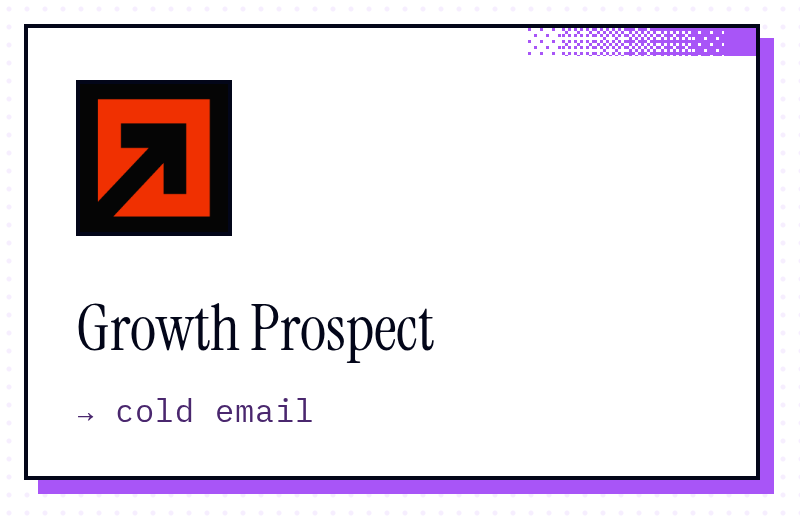</a>

  
  
  

